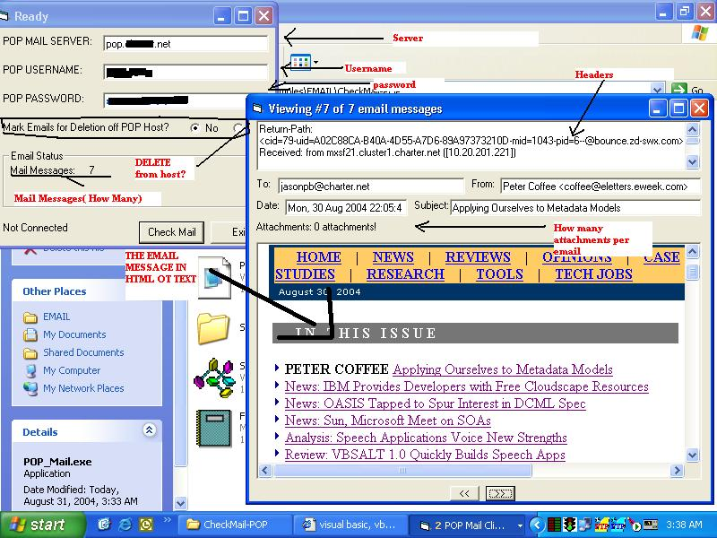



## POP\_MAIL v2\.0

### Description

This program checks your pop mail.

It downloads all your email, parses every message, gets all the useful info and displays it all in either html or text according to the content type. Also handles multiple attachments per email. If the code is lacking it should be easily modified.
 
### More Info
 
assumes some knowledge of pop protocol

             |
---                |---
**Submitted On**   |2004-08-31 03:35:24
**By**             |[Jason Barrera](https://github.com/Planet-Source-Code/PSCIndex/blob/master/ByAuthor/jason-barrera.md)
**Level**          |Advanced
**User Rating**    |4.8 (19 globes from 4 users)
**Compatibility**  |VB 6\.0
**Category**       |[Complete Applications](https://github.com/Planet-Source-Code/PSCIndex/blob/master/ByCategory/complete-applications__1-27.md)
**World**          |[Visual Basic](https://github.com/Planet-Source-Code/PSCIndex/blob/master/ByWorld/visual-basic.md)
**Archive File**   |[POP\_MAIL\_v1787838312004\.zip](https://github.com/Planet-Source-Code/jason-barrera-pop-mail-v2-0__1-55917/archive/master.zip)

### API Declarations

--None--

